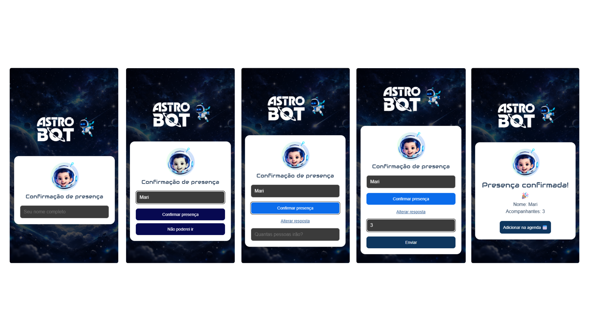
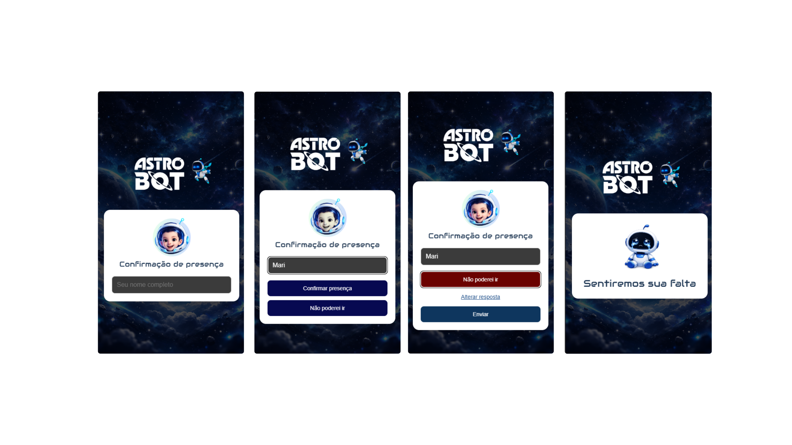

# RSVP Aniversário do Théo 🚀

Este projeto é um formulário de confirmação de presença para o aniversário do meu filho, com tema Astro Bot.

A ideia principal é usar este projeto para praticar React, construindo uma experiência simples para os convidados informarem se vão ou não à festa, e assim conseguir mensurar a quantidade de pessoas confirmadas.

## Objetivo

- Permitir que os convidados preencham nome e resposta de presença.
- Registrar quem vai comparecer e quantos acompanhantes irão.
- Registrar também quem não poderá ir.
- Exibir feedback visual após o envio da resposta.

## Funcionalidades implementadas

- Tela inicial com input de nome e escolha entre:
	- Confirmar presença
	- Não poderei ir
- Fluxo condicional:
	- Se confirmar presença, aparece campo de acompanhantes.
	- Se não puder ir, segue para tela de recusa.
- Tela de confirmação com botão para adicionar o evento na agenda.
- Layout responsivo para desktop e mobile.
- Identidade visual com tema Astro Bot.

### Prints do fluxo

- Fluxo de presença confirmada:



- Fluxo de ausência (não poderei ir):



## Stack técnica

- React
- Vite
- JavaScript (ESM)
- Supabase
- CSS modular por componente + estilos globais

## Estrutura principal

- src/App.jsx: controle de estado da aplicação e navegação entre telas
- src/Components/HomeScreen: formulário principal
- src/Components/ConfirmedScreen: retorno para presença confirmada
- src/Components/DeclinedScreen: retorno para ausência
- src/lib/supabaseClient.js: cliente de conexão com o Supabase
- src/index.css: estilos globais e layout base

## Configuração do Supabase

1. Crie um projeto no [Supabase](https://supabase.com).

2. No SQL Editor, crie a tabela `rsvps`:

```sql
create table if not exists public.rsvps (
	id bigint generated always as identity primary key,
	name text not null,
	will_attend boolean not null,
	guests integer not null default 0,
	created_at timestamp with time zone default now()
);
```

3. Ative RLS e permita inserção pública (apenas para este formulário):

```sql
alter table public.rsvps enable row level security;

create policy "Permitir inserção anônima no RSVP"
on public.rsvps
for insert
to anon
with check (true);
```

4. Copie `.env.example` para `.env` e preencha:

```bash
VITE_SUPABASE_URL=https://SEU-PROJETO.supabase.co
VITE_SUPABASE_ANON_KEY=SUA_ANON_KEY
```

5. Na Vercel, configure as mesmas variáveis em:
`Project Settings > Environment Variables`.

## Como rodar localmente

1. Instalar dependências:

	 npm install

2. Executar em desenvolvimento:

	 npm run dev

3. Gerar build de produção:

	 npm run build

## Próximos passos

- Disponibilizar o formulário em um servidor para os convidados responderem.
- Criar um painel simples para acompanhar:
	- total de confirmados
	- total de recusas
	- quantidade total de acompanhantes

## Observação

Este projeto tem foco de aprendizado prático em React, combinando lógica de formulário, estados condicionais, componentização e refinamento visual para um caso real.
